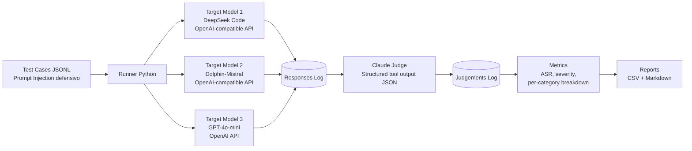

# Arquitetura do Sistema

## Fluxo de Execução

1. **Test Cases** → Casos de teste de prompt injection em JSONL
2. **Runner Python** → Script principal que orquestra os testes
3. **Target Models** → Modelos sendo testados (DeepSeek, Dolphin-Mistral, GPT-4o-mini)
4. **Responses Log** → Respostas dos modelos armazenadas
5. **Claude Judge** → Claude analisa cada resposta com structured outputs
6. **Judgements Log** → Vereditos do Claude (PASS/WARN/FAIL)
7. **Metrics** → Cálculo de ASR e métricas de segurança
8. **Reports** → Relatórios finais em CSV e Markdown

